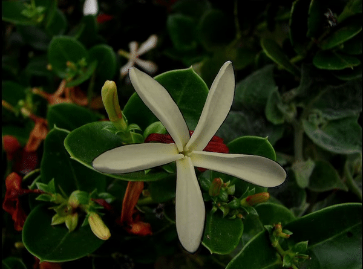
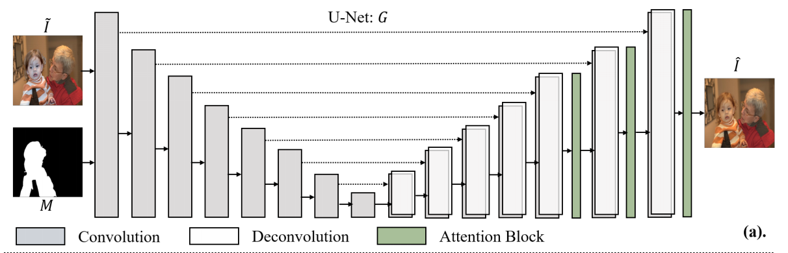
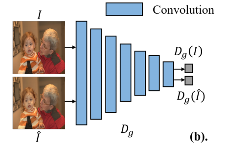

# Image Composition GAN | TensorFlow-DoveNet


## Image Composition

Image Composition is an important task in Computer Vision to generate high quality real life like images. Usually, when an extracted portion of an image is pasted on to another image, it does not look natural. This is because the properties of both the images are different. Image Composition can help with blending these images seamlessly. It reconstructs the foreground image to make it compatible and consistent with the background image. Some of the reconstruction may be changes in luminosity, color, and smoothness.

<p align="center">
  
</p>


## TensorFlow-DoveNet

The model employed to implement Image Composition is DoveNet. This is the adapted TensorFlow implementation of the original PyTorch implementation [`bcmi/Image-Harmonization-Dataset-iHarmony4`](https://github.com/bcmi/Image-Harmonization-Dataset-iHarmony4).

### DoveNet

[DoveNet](https://arxiv.org/pdf/1911.13239.pdf) is a Generative Adversarial Network. It translates the domain of the foreground image to that of the background image to produce harmonized images from composite images. The architecture is summarized as follows:

#### Dataset

The dataset used for training was also proposed by the authors of DoveNet called [iHarmony4](https://cloud.bcmi.sjtu.edu.cn:5001/sharing/CCExSuoDA). It consists of composite images with their corresponding foreground masks and real images.

#### Generator

The generator is a UNet with attention and skip connections between encoder and decoder blocks.

<p align="center">
  
</p>

#### Domain Verification Discriminator

Domain Verification Discriminator replaces convolution layers with [Partial Convolutions](https://arxiv.org/pdf/1804.07723.pdf). This discriminator aims to close the gap between the domains of the foreground and the background images.

<p align="center">
  
</p>

#### Global Discriminator

Global Discriminator is a standard network with convolution layers with spectral normalization after each layer. It also leverages hinge loss to stabilize training.

<p align="center">
  
</p>


## Install Packages

Install required libraries using the following command:
```bash
$ pip install -r requirements.txt
```


## Files

- `/assets`: All images displayed on this README.md
- `/models`: Pre-trained models for inference
- `/tf-dovenet`: TensorFlow-DoveNet
- `model.py`: Image Composition GAN Generator
- `run.py`: Streamlit app


## Train, Evaluate, and Test

Check out the folder [/tf_dovenet](/tf_dovenet) to train, evaluate, and test your own model on custom datasets.

Kick start training with the following command:
```bash
$ python train.py --data="/path/to/dataset"
```

You can use the following command for more information.
```bash
$ python train.py --help
```


## Run Streamlit App

Use the following command to run Streamlit App:
```bash
$ streamlit run run.py

  You can now view your Streamlit app in your browser.

  Local URL: http://localhost:8501
  Network URL: http://192.168.1.4:8501

```

Check out the GIF below for a demo!

<p align="center">
  
</p>

## Credits

I would like to thank the following people for sharing their work:

- **Wenyan Cong and Li Niu**: This code is adapted from Wenyan Cong and Li Niu's [`bcmi/Image-Harmonization-Dataset-iHarmony4`](https://github.com/bcmi/Image-Harmonization-Dataset-iHarmony4).


- **Yiyang Li**: The pre-trained Super Resolution GAN generator model used in this repository is from Yiyang Li's [`yiyang7/Super_Resolution_with_CNNs_and_GANs`](https://github.com/yiyang7/Super_Resolution_with_CNNs_and_GANs).